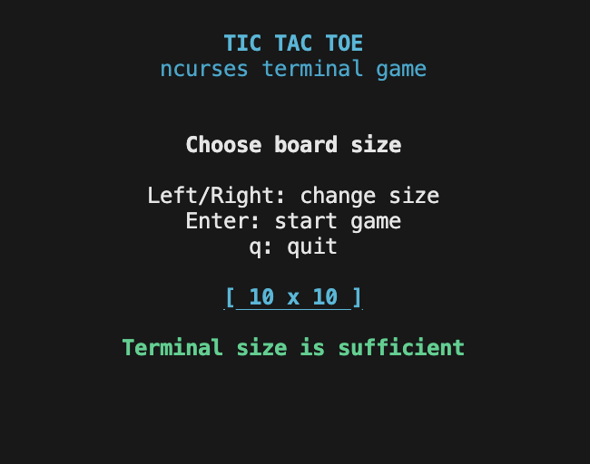
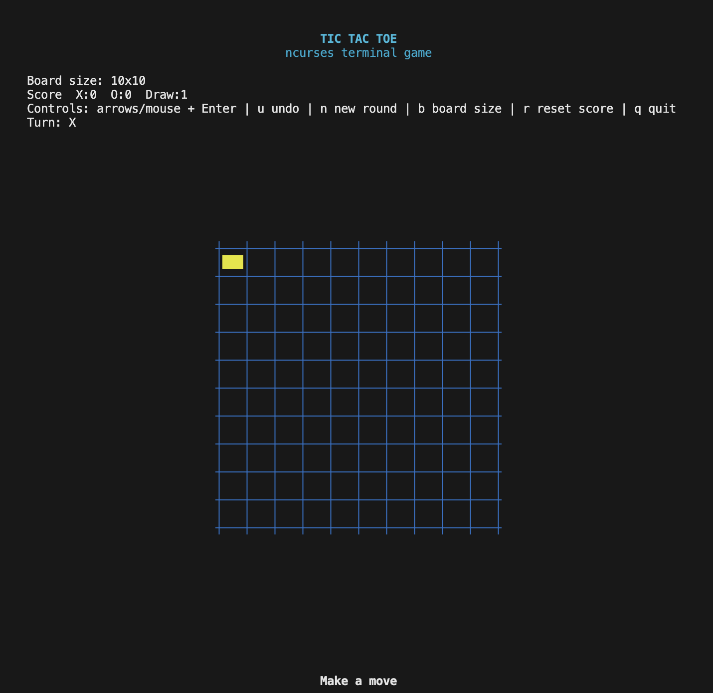
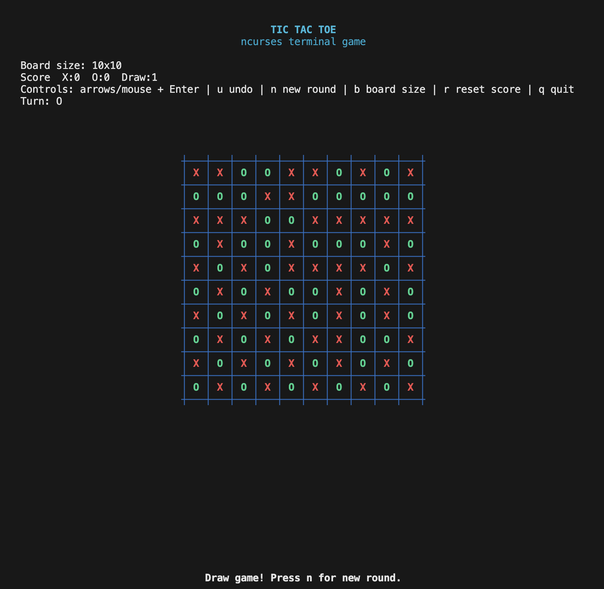

# Tic Tac Toe with Ncurses

Designed and implemented a dynamic Tic-Tac-Toe game in C++ using the Ncurses library for terminal-based graphical representation, with board sizes ranging from 3x3 to 15x15. I used the feature called Ncurses which integrating ncurses for the main gameplay loop and utilizing the mouse interactions feature to allow users to click on the square to play on it. It provides an interactive experience where players can choose board dimensions and play the game in the terminal.

## Features

- Dynamic board sizes ranging from 3x3 to 15x15.
- Colorful ncurses interface with a centered game board and status banner.
- Support for mouse input for cell selection.
- Turn-based gameplay for two players.
- Detection of win, loss, or draw scenarios.
- Session scoreboard (X wins, O wins, draws).
- Winning-line highlighting when a player wins.
- Undo support for the most recent move.
- In-game controls for new round, reset score, and board-size change.
- Graceful exit functionality.

## Requirements

- A terminal with Ncurses support.
- C++ compiler (e.g., g++).
- Ncurses library installed on the system.

## Compilation Instructions

1. Ensure you have Ncurses installed on your system.
2. Compile the program using g++:
   ```
   g++ -std=c++17 -Wall -Wextra -pedantic ncurses.cpp -lncurses -o tic_tac_toe
   ```

## Usage Instructions

1. Run the compiled program:
   ```
   ./tic_tac_toe
   ```
2. Follow the on-screen menu to choose the board size or quit the program.
3. Use arrow keys to move the cursor, and press Enter or Space to place your move.
4. You can also click with the mouse to select and place a move.
5. During a round, you can use:
   - `u` to undo the latest move
   - `n` to start a fresh round on the same board size
   - `b` to return to board-size selection
   - `r` to reset the scoreboard
   - `q` to quit
6. The game ends when a player wins or the board is full.

## Gameplay Instructions

- **Start the Game:** After choosing the board size, the game initializes with an empty board.
- **Turn Indicators:** Each player takes turns. Player 1 is represented by `X`, and Player 2 is represented by `O`.
- **Winning Conditions:**
  - Complete a row, column, or diagonal with your symbol.
- **Drawing:** If the board is filled without a winner, the game ends in a draw.
- **Score Tracking:** Scores persist across rounds until reset.

## Limitations

- Requires a terminal that supports Ncurses.
- Limited to two players.

## License

This project is licensed under the MIT License. See `LICENSE` for details.

## Example Outputs




